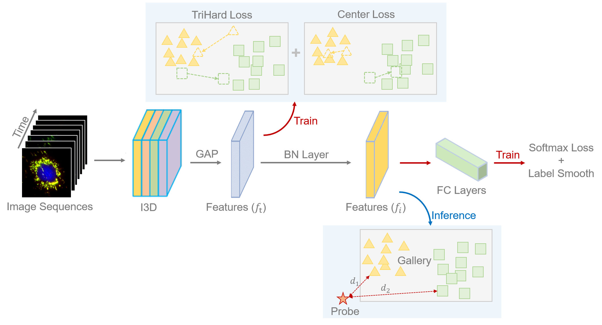
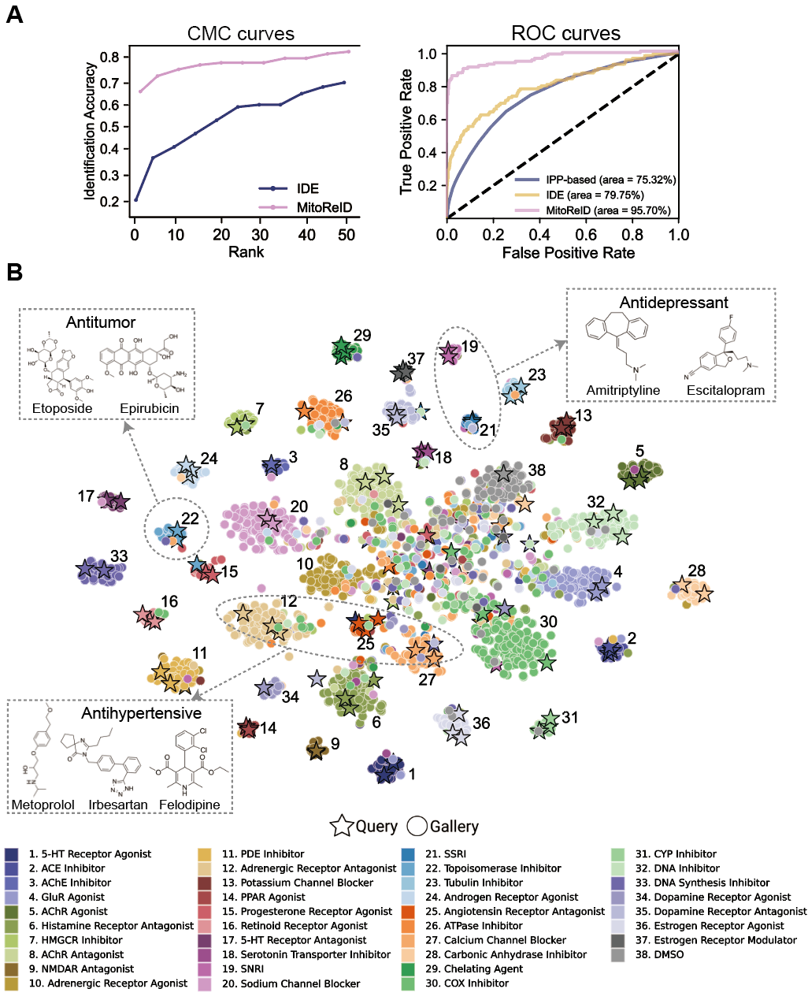

# Deep learning large-scale drug discovery and repurposing

## Authors

- [Weiming Li](https://github.com/liweim)

## Overview

### Introduction

It is rather challenging to do large-scale drug discovery and repurposing. Identifying mechanism of action (MOA) of
active substances is crucial yet current approaches like omics-based methods are costly and low-throughput, while
structure-based predictions often have unacceptably high false-positive rates. Here, we present a novel approach for MOA
identification based on high-throughput longitudinal profiling of mitochondrial phenotypes to expedite large-scale drug
repurposing, target identification, and the discovery of new therapeutic interventions. By investigating the effects of
drugs on mitochondrial morphology and membrane potential, we established a pipeline for the acquisition of time-resolved
mitochondrial images, resulting in a dataset that comprised a total of 570,096 single-cell images from exposures to
1,068 FDA-approved drugs. We then developed a deep learning model named MitoReID with re-identification (ReID) framework
and an I3D ResNet backbone. The model achieved 76.32% Rank-1 and 65.92% mean Average Precision (mAP) on the testing set
and successfully identified the MOAs for 6 novel drugs based on the temporal characteristics of mitochondrial
phenotypes. Furthermore, MitoReID identified COX-2 inhibition as the MOA of the natural tea compound epicatechin, which
was confirmed by in vitro validations. Our approach thus provides an automated and cost-effective alternative for lead
identification that could accelerate large-scale drug development and target discovery.

### Pipeline of MitoReID



### Model performance

Below are the CMC and ROC curves for validation, along with the T-SNE plot illustrating the learned features extracted
from the query set (denoted by points) and the gallery set (denoted by stars). These features were extracted from
MitoReID, trained on 38 MOA classes.



### Methods comparison in identifying 38 MOAs based on temporal mitochondrial phenotypes

|     Methods     | Accuracy/% | AUC/% | Rank-1/% | Rank-5/% | Rank-10/% | mAP/% | 
|:---------------:|:----------:|:-----:|:--------:|:--------:|:---------:|:-----:|
|    IPP-based    |   15.72    | 75.32 |    -     |    -     |     -     |   -   |
|       IDE       |   32.46    | 82.96 |  23.68   |  36.84   |   49.12   | 9.06  |
| MitoReID (Ours) |   82.46    | 97.83 |  76.32   |  84.21   |   84.21   | 65.92 |

### Ablation studies of MitoReID

|           Methods            | small (ResNet-18) | small (ResNet-18) | base (ResNet-50) | base (ResNet-50) |
|:----------------------------:|:-----------------:|:-----------------:|:----------------:|:----------------:|
|                              |     Rank-1/%      |       mAP/%       |     Rank-1/%     |      mAP/%       |
|           MitoReID           |       75.44       |       58.35       |      76.32       |      65.92       |
|         -- pretrain          |  37.72 (-37.72)   |  16.13 (-42.22)   |  39.47 (-36.85)  |  22.29 (-43.63)  |
| -- retain temporal dimension |   31.58 (-6.14)   |   12.77 (-3.36)   |  32.46 (-7.01)   |  14.95 (-7.34)   |
|    -- temporal dimension     |   3.51 (-28.07)   |   2.73 (-10.04)   |  4.39 (-28.07)   |  2.77 (-12.18)   |

## System Requirements

### Hardware requirements

This project requires a computer with at least 16GB GPU memory for training and 3GB GPU memory for inference. All the
models present in the paper were trained with Nvidia V100 (32 GB version).

### Software requirements

#### OS Requirements

This project is supported for all OS. The package has been tested on the following systems:

- Windows: Windows 10
- Linux: Ubuntu 18.04

#### Python Dependencies

Install pytorch GPU version, you can use other versions besides the following example:

```
pip install torch==1.10.1+cu102 torchvision==0.11.2+cu102 -f https://download.pytorch.org/whl/torch_stable.html
```

Install other packages listed in requirements.txt. Python version has been tested is 3.8.

```
pip install -r requirements.txt
```

The overall installation will take about half hour.

## Instructions

### Jupyter notebook

We provide step-by-step jupyter notebook `./run.ipynb` for beginners. If you are more familiar with command line, you
can move forward.

### Command line instructions

1. `cd` to folder where you want to download this repo.

2. Run `git clone https://github.com/liweim/MitoReID.git`

3. Download the Mito dataset in zip format from Google drive and unzip it.
   ```
   python utils/download.py --file_name Mito.zip --save_folder ./data
   ```
   The dataset's folder structure is as follows. Notably, l1, l2, and l3 represent three replicated experiments, each
   sharing an identical folder structure.

   ```
   - l1: experiment 1
   -- train: data for training.
   -- query: data for evaluation, query and gallery are used together to evaluate.
   -- gallery: data for evaluation, query and gallery are used together to evaluate.
   -- nc: natural compounds.
   - l2: experiment 2
   -- (same as l1)
   - l3: experiment 3
   -- (same as l1)
   - novel: unseen novel FDA-approved drugs.
   - annotation.xlsx: annotations for the dataset. There are two sheets in the excel: 'FDA-list' for FDA approved drugs, 'Novel-list' for novel compounds.
   ```

4. (Optional) Prepare your own dataset.

   Create a directory to store the raw images. The images of one drug should be stored in one folder and follow this
   naming conventions:
   ```
   {drug_id}/{drug_id}_{time}_{w} (For example: 5/5_16_w2)
   ```
   Run the following script to split cells from the raw images.
   ```
   python utils/generate_dataset.py --folder /path/to/your/dataset/folder --save_folder /path/to/your/save/folder
   ```
   Change the path settings in `configs/mitoreid.yml`. Compute the average mean and std of the dataset by running the
   following script and change the `mean` and `std` settings in `configs/mitoreid.yml`.
   ```
   python utils/get_mean_std.py --folder /path/to/your/save/folder
   ```

5. Use the trained model to test on the query set. Configurations can be refered to `configs/test.yml`.
   Parameters explanation of the configurations can be found in main.py.
   Evaluation metrics are accuracy, rank-k and mAP.
   The model weight `mitoreid-resnet-50-pretrain` will be downloaded automatically for testing and predicting.
   All the model weight you can download are listed below. They all trained with I3D ResNet network.

   Note: The standard I3D ResNet network downscales the temporal dimension throughout all stages while the modified I3D
   ResNet network only downscales the temporal dimension in the first two stages.

- resnet-18-kinetics: weight trained with standard I3D ResNet-18 network on Kinetics-400 dataset.
- resnet-50-kinetics: weight trained with standard I3D ResNet-50 network on Kinetics-400 dataset.
- resnet-18-mito: weight trained with modified I3D ResNet-18 network on Mito dataset using self-supervised pretraining
  technique.
- resnet-50-mito: weight trained with modified I3D ResNet-50 network on Mito dataset using self-supervised pretraining
  technique.
- ide: weight trained with IDE framework with modified I3D ResNet-18 network on Mito dataset,
  pretrained from resnet-18-kinetics.
- mitoreid-resnet-18: weight trained with MitoReID framework with modified I3D ResNet-18 network on Mito dataset,
  pretrained from resnet-18-kinetics.
- mitoreid-resnet-50: weight trained with MitoReID framework with modified I3D ResNet-50 network on Mito dataset,
  pretrained from resnet-50-kinetics.
- mitoreid-resnet-18-standard: weight trained with MitoReID framework with standard I3D ResNet-18 network on Mito
  dataset, pretrained from resnet-18-kinetics.
- mitoreid-resnet-50-standard: weight trained with MitoReID framework with standard I3D ResNet-50 network on Mito
  dataset, pretrained from resnet-50-kinetics.
- mitoreid-resnet-18-image: weight trained with MitoReID framework with standard I3D ResNet-18 network on Mito
  dataset (image only), pretrained from resnet-18-kinetics.
- mitoreid-resnet-50-image: weight trained with MitoReID framework with standard I3D ResNet-50 network on Mito
  dataset (image only), pretrained from resnet-50-kinetics.
- mitoreid-resnet-18-pretrain: weight trained with MitoReID framework with modified I3D ResNet-18 network on Mito
  dataset,
  pretrained from resnet-18-mito.
- mitoreid-resnet-50-pretrain: weight trained with MitoReID framework with modified I3D ResNet-50 network on Mito
  dataset,
  pretrained from resnet-50-mito.

  Note: the model weights provided are trained with multiple GPUs. I have tried my laptop with single GPU and not work,
  in this case, you can set the `device_ids` to 'cpu' in `configs/test.yml`.
   ```
   python main.py --config configs/test.yml --task test
   ```

6. Use the trained model to predict the natural compounds' MOAs. Configurations can be refered to `configs/predict.yml`.
   You are expected to get the predicted MOA id (pred), score (rank1 and cosine_distance) and the name of the MOA (
   pred_name).
   ```
   python main.py --config configs/predict.yml --task predict
   ```

7. Fine-tune your model based on the self-supervised pretrained weight. Configurations can be refered
   to `configs/fine-tune.yml`. The pretrained weight `resnet-50-mito` will be downloaded automatically.
   Train on V100 will take about 1 hour. Wandb is used to visualize the training process, register the wandb account
   in `https://wandb.ai/site` if you don't have. If you get GPU out-of-memory error, set
   the `bs` to a lower value. If you get CPU out-of-memory error, set the `num_workers` to a lower value.
   ```
   python main.py --config configs/fine-tune.yml --task train
   ```

8. Pretrain your model using self-supervised technique. Configurations can be refered to `configs/pretrain.yml`.
   The pretraining is based on the weight trained on Kinetics-400 dataset, which is benchmark for video
   classification. The pretrained weight `resnet-50-kinetics` will be downloaded automatically.
   Train on V100 will take about 4 hours.

   Note: Train from scratch is not recommended considering the difficulty of image
   sequences classification. Too much training may lead to overfitting, don't set too large `epoch` in the config.
   ```
   python main.py --config configs/pretrain.yml --task train
   ```

9. Train your model from scratch base on the weight trained on Kinetics-400 dataset. Configurations can be refered
   to `configs/train.yml`. The pretrained weight `resnet-50-kinetics` will be downloaded automatically.
   Train on V100 will take about 5 hours.
   ```
   python main.py --config configs/train.yml --task train
   ```